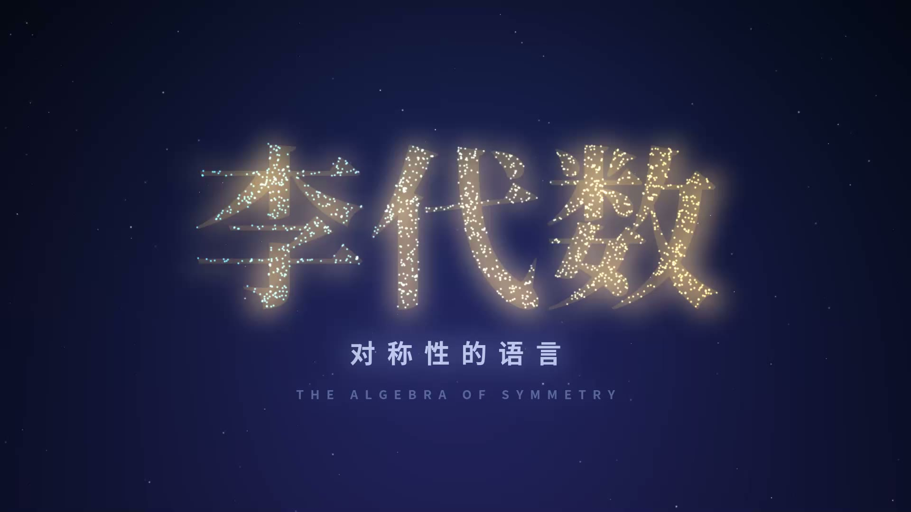
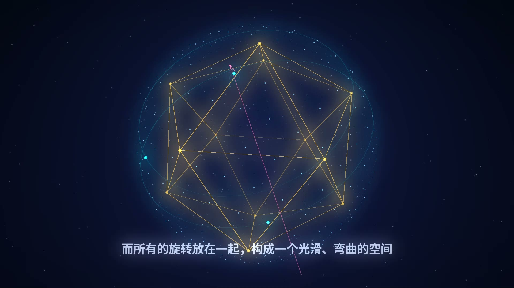
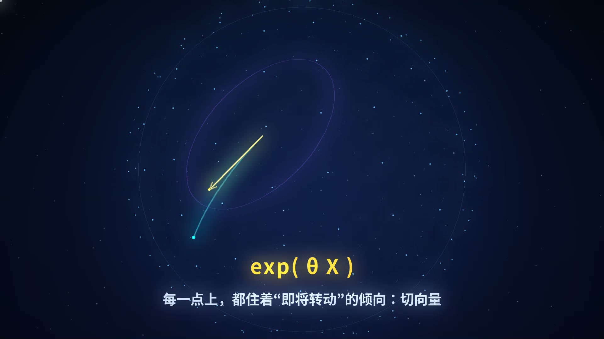
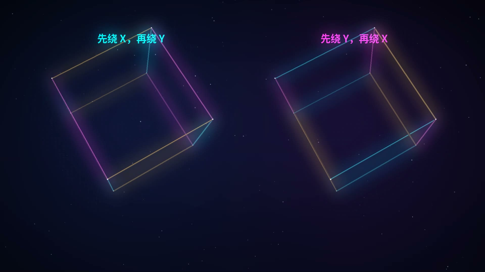
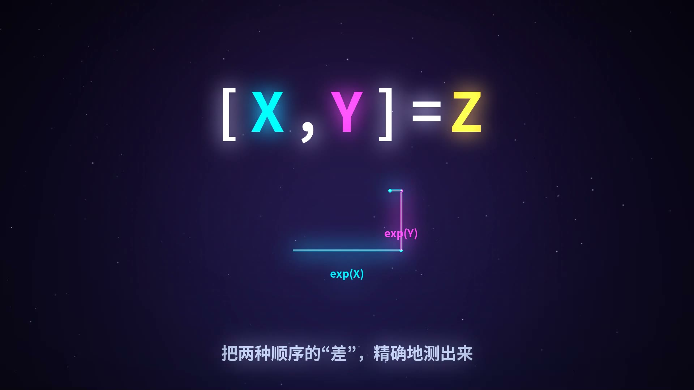
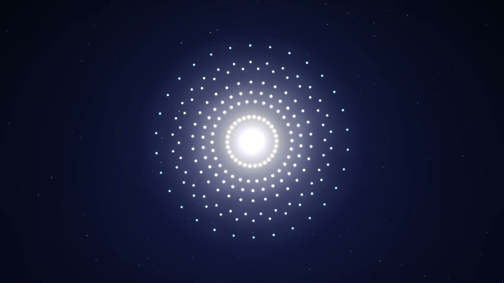
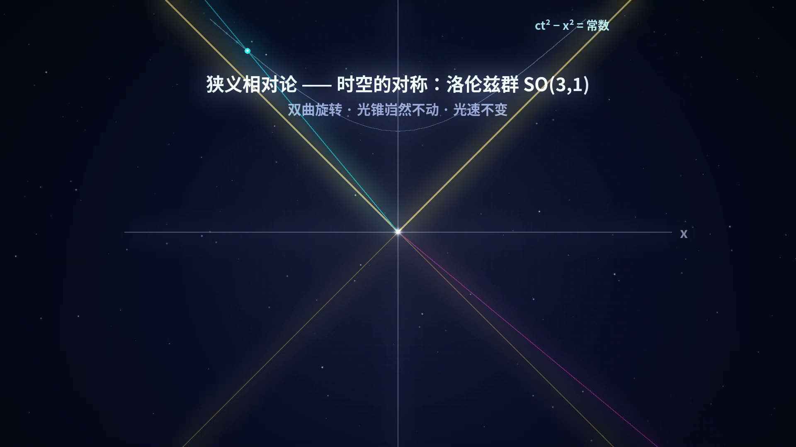
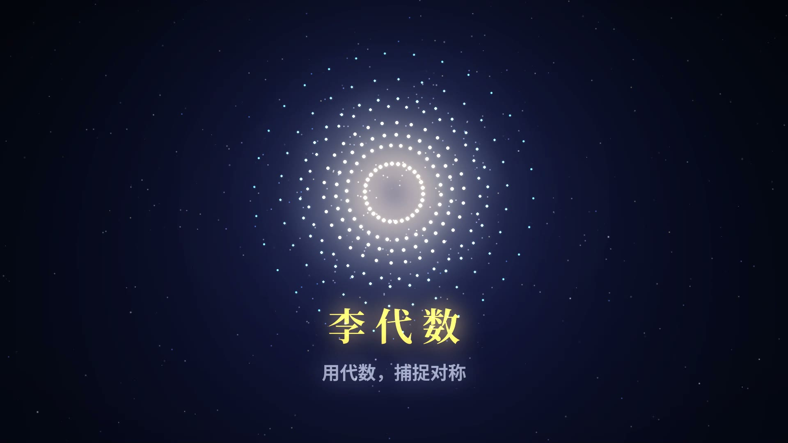

# 李代数宣传片《对称性的语言》

> A 3-minute cinematic promo for the Lie Algebra — every frame and every note generated by code.
> 从 SO(3) 的旋转之美，到 E8 的 248 维对称殿堂。

<p align="center">
  
  
</p>
<p align="center">
  
  
  
</p>
<p align="center">
  
  
</p>
<p align="center">
  
</p>

## 成片

**《对称性的语言》** · 1920×1080 · 30fps · 3′00″ · H.264 + AAC

📥 从 [Releases](../../releases) 页面下载完整成片 `李代数宣传片.mp4`。

## 分镜

| 时间 | 幕 | 内容 |
|---|---|---|
| 0:00 | 序 | 1500 颗星尘粒子汇聚成金色宋体标题「李代数」 |
| 0:13 | 旋转之美 | 二十面体线框 + 球面点阵绕任意轴旋转，转轴漂移、光轨残影 → 李群 SO(3) |
| 0:40 | 无穷小 | 切平面上的向量渐渐生长，青色弧线掠过球面 —— 指数映射 exp(θX) |
| 1:07 | 顺序的秘密 | 分屏双立方体：先 X 后 Y ≠ 先 Y 后 X，旋转会记住顺序 |
| 1:29 | 李括号 | [X, Y] = Z 霓虹公式逐字点亮 + commutator square 回路动画 |
| 1:47 | 对称性宇宙 | 经典家族星座（so/su/sp/sl 与 G2·F4·E6·E7·E8）→ 白闪 → **E8 绽放** |
| 2:17 | 宇宙中的李代数 | 洛伦兹光锥的双曲旋转 / SU(3) 重子八重道 / 诺特定理四连线 |
| 2:47 | 尾声 | 粒子回涌成旋转的 E8，落版「用代数，捕捉对称」 |

## 技术亮点

- **数学是真的**：E8 的 240 个根由根系统直接构造（112 个二进制型 + 128 个偶号半整数型），经 Coxeter 平面投影得到 30 重对称图案，程序断言 24 重旋转对称误差 ~1e-15；洛伦兹双曲线、 Rodrigues 旋转、八重道量子数全部精确计算
- **手写渲染引擎**（`engine.py`）：分层架构 = 静态深空背景 + RGBA 叠加层 + 加法发光层 + 1/4 分辨率辉光层；手写透视投影、深度排序、高斯 sprite 粒子
- **配乐也是代码**（`music.py`）：A 小调 Am–F–C–G 进行，BPM 96；pad 双振子失谐、四种鼓点、16 分琶音、多抽头混响——结构与 8 幕逐段对齐
- **并行渲染**：5400 帧（180s×30fps）按 41 个分片在 28 进程上并行，约 7 分钟完成

## 快速开始

```bash
# 依赖: Python 3.11+, numpy, pillow; ffmpeg (需含 libopenh264 或 libx264)
pip install numpy pillow

# 预览某个场景的关键帧 (输出到 preview/)
python3.11 preview.py "s5:750,s1:400"

# 全量并行渲染 (41 个分片 -> chunks/ -> 无声底片)
python3.11 render_all.py 24

# 合成配乐 (输出 music.wav)
python3.11 music.py

# 混流成片
ffmpeg -y -i chunks/video_noaudio.mp4 -i music.wav \
       -c:v copy -c:a aac -b:a 192k -shortest 李代数宣传片.mp4
```

## 目录结构

```
├── src/
│   ├── engine.py      # 渲染引擎：画布分层 / 辉光 / 3D 投影 / 文字
│   ├── e8.py          # E8 根系统构造 + Coxeter 平面投影
│   ├── scenes_a.py    # 场景 0–3：标题 / SO(3) / 指数映射 / 不可交换
│   ├── scenes_b.py    # 场景 4–7：李括号 / E8 / 物理应用 / 尾声
│   ├── music.py       # 配乐合成（numpy 直出 180s 立体声）
│   ├── render_all.py  # 多进程分片渲染 + concat 调度
│   └── preview.py     # 关键帧预览工具
├── assets/            # 成片预览截图
└── docs/              # 备用
```

## 环境备注

- 本项目在 ffmpeg 无 `libx264` 的构建上开发，`render_all.py` 使用 `libopenh264`（16 Mbps）；若你的 ffmpeg 带 x264，可把 `-c:v libopenh264 -b:v 16M` 换成 `-c:v libx264 -crf 16`
- 中文字体依赖 Noto Sans/Serif CJK（`/usr/share/fonts/opentype/noto/`），路径写在 `engine.py` 顶部，可自行替换
- 脚本里的 Unicode 上下标（如 ₓ、⁺）刻意避免使用——CJK 字体缺字；π、θ、Σ、° 等希腊字母与常用符号可用

---

*每一帧都由 `numpy` 与 `PIL` 写成；每一个音都由 `sin` 与噪声生成。数学不在象牙塔里，它写在宇宙的运行规律中。*
