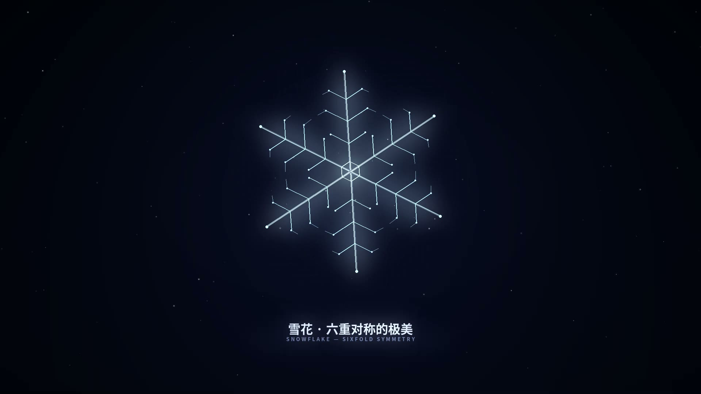
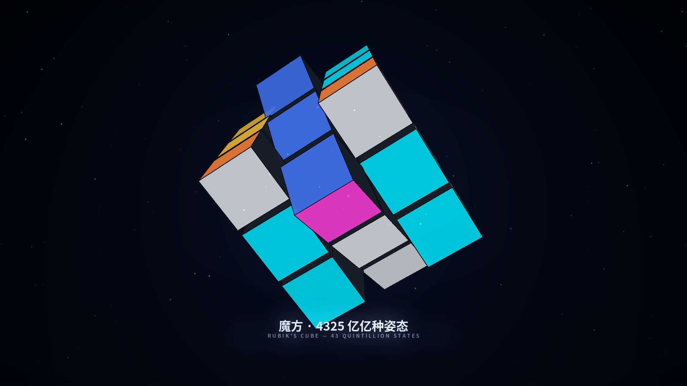
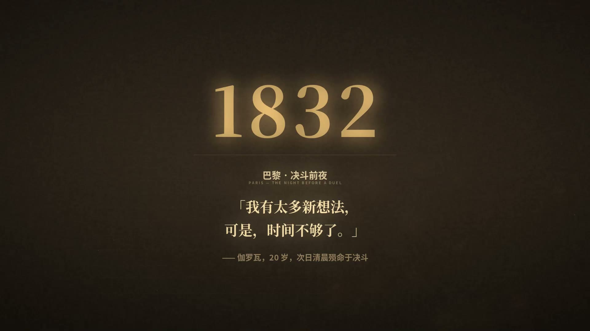
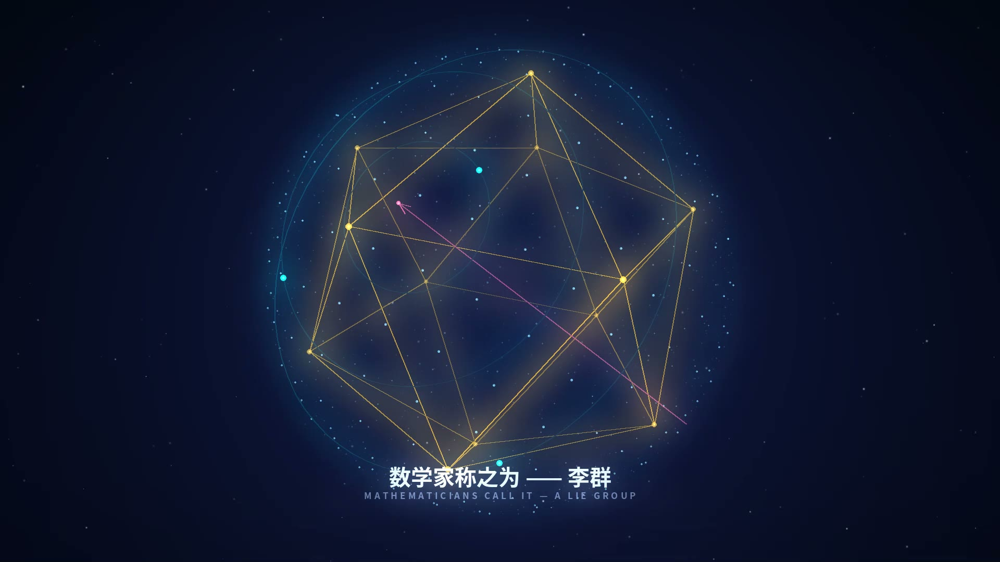
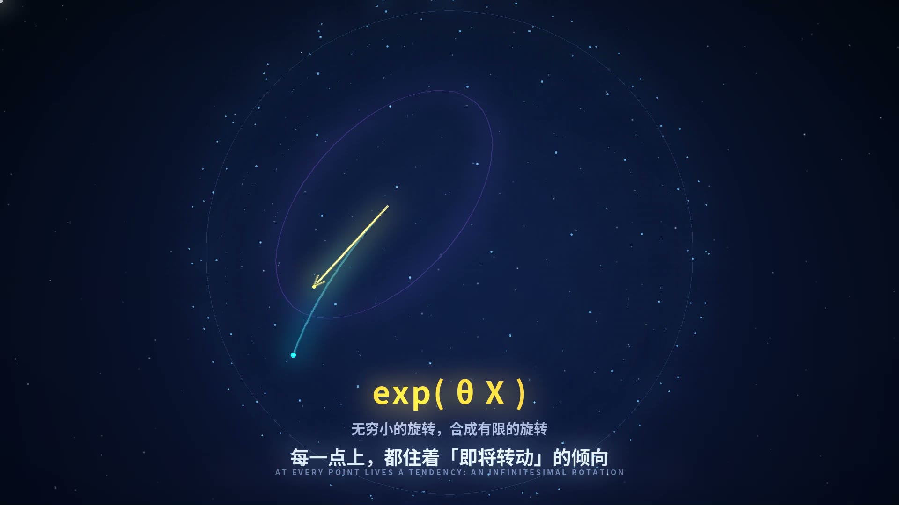
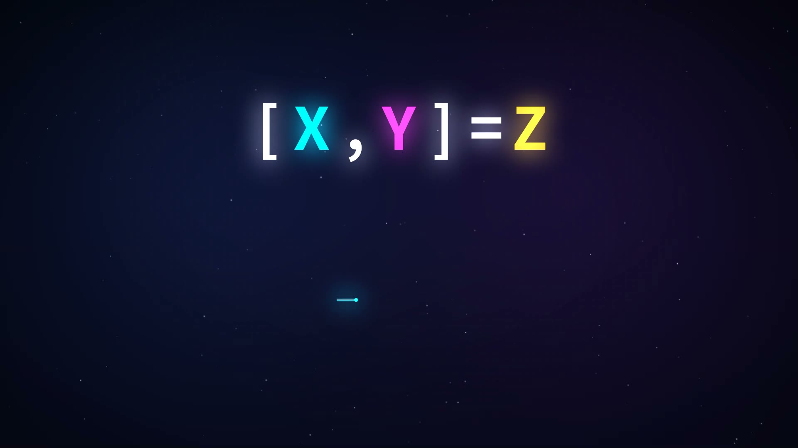
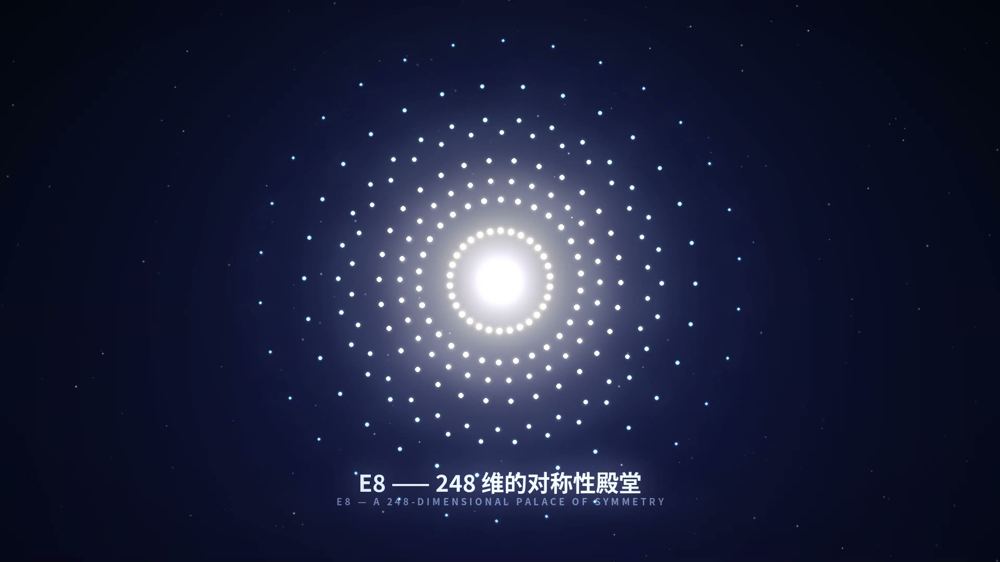

# 李代数宣传片《对称性的语言》

> A 3-minute cinematic promo for the Lie Algebra — every frame and every note generated by code.
> 从一朵雪花的六重对称、一个魔方的扭转，到 E8 的 248 维对称殿堂。

<p align="center">
  
  
</p>
<p align="center">
  
  
  
</p>
<p align="center">
  
  
</p>
<p align="center">
  
</p>

## 成片

**《对称性的语言》** · 1920×1080 · 30fps · 3′08″ · H.264 + AAC

📥 从 [Releases](../../releases) 页面下载完整成片 `李代数宣传片.mp4`。

## 本版更新（v1.1）

参考学习了 [abstract-algebra-promo](https://github.com/AnctyEnly453/abstract-algebra-promo) 与
[linear-algebra-promo](https://github.com/guchang233/linear-algebra-promo) 两个优秀项目的创作手法——
快闪剪辑、历史叙事、实例先行、绚丽视觉——对本片进行了全面重制：

- **悬念式开场**：不再直接报题——雪花（六重对称）→ 魔方（4 连拧快闪）→ 光点爆开 →「它们有什么共同点？」
- **历史幕**：1832 年伽罗瓦手稿（旧纸纹理 + 心跳 + 枪响白闪）→ 极光中的 Sophus Lie →「李群」大字落版
- **罗马数字章节卡 ×6**（I 旋转 / II 无穷小 / III 李括号 / IV 对称之花 / V 万物皆对称 / 终章），全部对齐小节切点
- **中英双语字幕**贯穿全片
- **终章 beat-cut 混剪**：16 张全片高光切片按 0.625s 拍点回闪，punch-in + RGB 通道错位色差 + 白闪，最后汇聚成 E8 爆炸落版
- **配乐全面重写**（187.5s）：SFX 轨与画面逐点对齐——心跳、枪响、魔方咔哒、雪花 ping、爆闪、boom、落版三音

## 分镜

| 时间 | 幕 | 内容 |
|---|---|---|
| 0:00 | 序 · 悬念 | 引言「有些美，不在形状里」→ 雪花六重对称快闪 → 魔方 4 连拧 →「它们有什么共同点？」 |
| 0:13 | 历史 | 1832 手稿：伽罗瓦最后的夜晚（心跳 → 枪响白闪）→ 群论诞生 → 极光中的 Sophus Lie → 章节卡 I |
| 0:40 | I · 旋转 | 球面点阵绕任意轴旋转，转轴漂移、光轨残影 → 李群 SO(3) |
| 1:07 | II · 无穷小 | 切平面上的向量渐渐生长，青色弧线掠过球面 —— 指数映射 exp(θX) |
| 1:30 | III · 李括号 | 分屏双立方体：先 X 后 Y ≠ 先 Y 后 X →「≠」爆闪 → [X, Y] = Z 逐字点亮 → commutator 回路 |
| 1:55 | IV · 对称之花 | 经典家族星座（so/su/sp/sl 与 G2·F4·E6·E7·E8）→ 白闪 → **E8 绽放** |
| 2:20 | V · 万物皆对称 | 洛伦兹光锥的双曲旋转 / SU(3) 重子八重道 / 诺特定理四连线 → 落幅 |
| 2:42 | 终章 · 混剪 | 16 张高光切片按拍回闪（色差 + 白闪）→ 粒子汇聚 → E8 爆炸 → 落版「用代数，捕捉对称」 |

## 技术亮点

- **数学是真的**：E8 的 240 个根由根系统直接构造（112 个二进制型 + 128 个偶号半整数型），经 Coxeter 平面投影得到 30 重对称图案；魔方是真实的 26 块状态机（背面剔除 + 深度排序 + 贴纸旋转）；洛伦兹双曲线、Rodrigues 旋转、八重道量子数全部精确计算
- **手写渲染引擎**（`engine.py`）：分层架构 = 静态深空背景 + RGBA 叠加层 + 加法发光层 + 1/4 分辨率辉光层；手写透视投影、深度排序、高斯 sprite 粒子、手稿纸纹理
- **配乐也是代码**（`music.py`）：A 小调 Am–F–C–G 进行，BPM 96，全片 75 小节；pad 双振子失谐、四种鼓点、16 分琶音、多抽头混响；20+ 个 SFX cue 与画面逐点对齐
- **节奏即结构**：5625 帧 = 187.5s = 75 小节，所有字幕、切点、章节卡对齐拍（0.625s）或小节（2.5s）
- **并行渲染**：5625 帧按 42 个分片多进程并行，每分片独立 pipe 给 ffmpeg（libopenh264 16 Mbps）

## 快速开始

```bash
# 依赖: Python 3.11+, numpy, pillow; ffmpeg (需含 libopenh264 或 libx264)
pip install numpy pillow

# 预览某个场景的关键帧 (输出到 preview/)
python3.11 preview.py "s5:750,s1:400"

# 全量并行渲染 (42 个分片 -> chunks/ -> 无声底片)
python3.11 render_all.py 24

# 合成配乐 (输出 music.wav, 187.5s)
python3.11 music.py

# 混流成片
ffmpeg -y -i chunks/video_noaudio.mp4 -i music.wav \
       -c:v copy -c:a aac -b:a 192k -shortest 李代数宣传片.mp4
```

## 目录结构

```
├── src/
│   ├── engine.py      # 渲染引擎：画布分层 / 辉光 / 3D 投影 / 文字 / 双语字幕 / 章节卡
│   ├── e8.py          # E8 根系统构造 + Coxeter 平面投影
│   ├── scenes_a.py    # 场景 0–3：悬念开场（雪花/魔方）/ 历史幕 / 旋转 / 无穷小
│   ├── scenes_b.py    # 场景 4–7：李括号 / 对称之花 / 万物皆对称 / 终章混剪
│   ├── music.py       # 配乐合成（numpy 直出 187.5s 立体声 + SFX cue 轨）
│   ├── render_all.py  # 多进程分片渲染 + concat 调度
│   └── preview.py     # 关键帧预览工具
├── assets/            # 成片预览截图
└── docs/              # 备用
```

## 环境备注

- 本项目在 ffmpeg 无 `libx264` 的构建上开发，`render_all.py` 使用 `libopenh264`（16 Mbps）；若你的 ffmpeg 带 x264，可把 `-c:v libopenh264 -b:v 16M` 换成 `-c:v libx264 -crf 16`
- 中文字体依赖 Noto Sans/Serif CJK（`/usr/share/fonts/opentype/noto/`），路径写在 `engine.py` 顶部，可自行替换
- 脚本里的 Unicode 上下标（如 ₓ、⁺）刻意避免使用——CJK 字体缺字；π、θ、Σ、° 等希腊字母与常用符号可用

## 致谢

本片的剪辑手法与叙事结构参考学习了以下优秀项目：

- [AnctyEnly453/abstract-algebra-promo](https://github.com/AnctyEnly453/abstract-algebra-promo) — 快闪剪辑、历史叙事
- [guchang233/linear-algebra-promo](https://github.com/guchang233/linear-algebra-promo) — 实例先行、视觉冲击

---

*每一帧都由 `numpy` 与 `PIL` 写成；每一个音都由 `sin` 与噪声生成。数学不在象牙塔里，它写在宇宙的运行规律中。*
